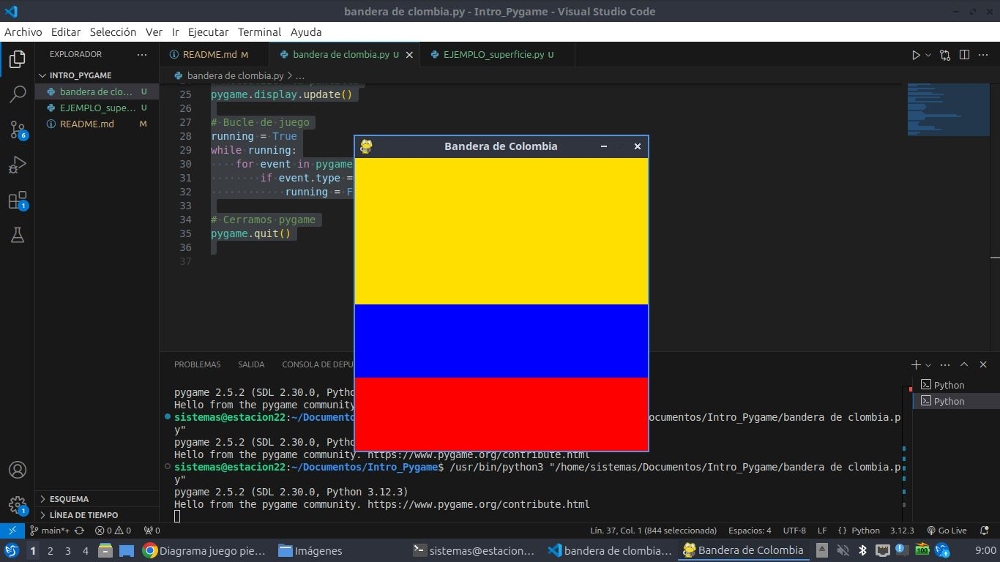

# Estructura de un juego en pygame
 
 ##  Inicializacion 

 - comoen todo programa de python, se debe importar los modulos o librerias a utilizar 
 `import pygame`

 - inicializar pygame usado la fucion init(). Inicializa todos los modulos e pygame importados.
 `pygame.init()`

 ## visualizacion de la ventana

`ventana = pygame.display.set_mode((600,400))`

- set_mode() es la funcion encargada de difinir el tamaño  de la ventana. En el ejemplo, se sta definiendo una ventana de 600 px de ancho, por 400 px de alto.

`pygame.display.set_caption("Mi ventana")`

- .set_caption() es la funcion que añade un titulo en en la ventana

### Funcion set_model 
`set_model(size = (0.0).flags = 0. dsplay = 0)`
- size = (000.400) : defineel tamaño de la pantalla
-  flags = define uno o mas conportamientos para la ventana.
    valores:
    - pygame.Fullscreen 
    - pygame.resizable
    Ejemplo:
    - flags = pygame.FULLSCREEN pygame
    Resizable: pantalla completa.
    dimenciones midificables 
## Bucle del juego - game loop
- blucle infinito del juego que se interrumpira al cumplir ciertos criterios 
- Reloj interno del juego 
- En cada iteracon de bucle del juego podemos moever un personje, o tener en cuenta que un objeto  alcanzado a otro o que a cruzado la linea de llegado quiere decier que la partida ha terminado 

- cada iteracion es una portunidad para actualizar todos los datos reacionados con el estado actual de la partida 

- en cada iteracion se realizan las siguientes tareas 
    1. comprobar que no alcancen las cndicones de parada, en cuyo caso se interrumpe el bucle.
    2. actualizar los recursos necesarios para la iteracion actual.
    3. obtener las entradas de sistemas, o de interaccion del jugador 
    4. obtener todas las identidades  que caracterizan el juego 
    5. refrescar la pantalla

    # Estructura de un juego en pygame 
    ## superficies pygame 
    - superficie:
    - elmento geometrico 
    - linea, poligono, imagen,texto que se muestra en la pantalla
    - las superficies se crean de difernte manera dependiendo del tipo:
    - imagen : image.load()
    - texto : font.reader()
    -superficie genrica : pygame .surface()
    - ventana de juego : pygame .display.set_mode()

    ## Bandera de Colombia con Pygame

```python
# Importamos la librería pygame
import pygame

# Inicializamos los módulos de pygame
pygame.init()

# Establecer título a la pantalla
pygame.display.set_caption("Bandera de Colombia")

# Establecemos las dimensiones de la ventana
ANCHO = 400
ALTO = 400
ventana = pygame.display.set_mode((ANCHO, ALTO))

# Definimos los colores
AMARILLO = (255, 223, 0) 
AZUL = (0, 0, 255)       
ROJO = (255, 0, 0)     

# Dibujar la bandera
ventana.fill(AMARILLO) 
pygame.draw.rect(ventana, AZUL, (0, ALTO // 2, ANCHO, ALTO // 4))  
pygame.draw.rect(ventana, ROJO, (0, (ALTO // 4) * 3, ANCHO, ALTO // 4))  

# Actualizar la pantalla
pygame.display.update()

# Bucle de juego
running = True
while running:
    for event in pygame.event.get():
        if event.type == pygame.QUIT:
            running = False  # Salir del bucle

# Cerramos pygame
pygame.quit()
```



## gestion del tiempo y los eventos 

### modulo time
- ofrecen varia funcines que permiten cronmetrar la sesion acrual (desde el init()) o pausar la ejecucion, por ejemplo:
    - Funcines:
        - pygame.tim.get_tickts
        - pygame.time.waitpyame.time.delay

    - Objeto clock
        - la funcion tick prmite actuaizar e reloj asociado con el juego acual 
        - se llama cada vez que se actualiza la pantalla del juego
        - Permite especificar el numero maximode fotogramas que se muestran por segundo, y por lo tanto controlar la velociadad de ejecucin   del juego.
        - si insertamos en un bluque de juego la siguiente linea, garantizamos que nunca se ira mas rapido de 50 fotograma por segundo: `clock.tick(50)` 

        ### gestion de eventos
        - Hayy diferentes formas para que el programa sepa que se ha desencadenando un evento
        - es ecensial que los programas puedadn conocer inmediatamente las acciones del jugador atravez del teclado, mause, joistick o cualquier otro periferico.

        #### funcion pygame.event.get
        - permiten obtener todos los eventos en espera deserrganizados y que estan disponibeesen un cl
        - si nohay ninguno, se obtiene una collecion vacia

```python 

    for event in pygame.event.get():
        if event.type == pygame.kEYDOWN:
            if event.key == pygame.K_ESCAPE:
                PARAR JURGO = True 
```
#### Funcion pygame. event.wait 
- Esta funcion espera a que ocurra un evento,y cuando sucede esta dispoible 

```python
while True:
        event = pygame.event.wait()
        if event.type == pygame.QUIT :
            break
```
### Funcion pygame.event.poll
- devuelve solo uno de os elemnetos que estan en la cola de espera


## sonidos en pygame
- pygame.mixer: modulo que permite la gestion del sonido 
- music: submodulo que gestiona la musica de fondo. Necesariamente solo hay uno a la vez
- sund: objjeto de mixer, que se puede instanciar varias veces para usarlo en los efectos de sonido del juego 

### archivos de sonido 
- se recomienda usar dos formatos principalmente:
    - formatoWAV (Waveform Audio File Frmat)
    - formato abierto y gratuito OGG

### chane (canal) en pygame
- un uego tiene varios canekes de sonido 
- sepede accinar un sonido al coal numero 1 y otro diferente al numero 2 
- entonces es ppocible reproducir sonidos simultaneamente activando su lectura en dieferentes caneles 

## sprites 
- objeto que asocia una ubicacion, una reprecentcion grafica (esta o aqulla imagen por ejemplo)
 y un conjunto de propiedades 
 - estas prpiedades puede ser un nmbre un texto  volores booleanos que caracteristicas el objeto en cuestion (por ejemplo si el objetose uede mover o no)
 - una posible traduccion del termino sprite podria se "imagen-objeto" que se actualiza con cada iteracion del bucle de juego 
 - cuanto mas complejo es el juego mas objetos graficos tiene que gestionar y actualizar lo que puede ser tedioso 
 - pygame usa noslo la nocion de srite, sino la nocion de grupo se spries (group)
 - la nocion de group permite agrupar los objetos del mismo tipo. ejmeplo: todoslos sodados de un ejercito, lo que se entiende como una coleccion de instancias de una clase soldado.
 - un determinado procesamiento se puede aplicar a un conjunto o subconjunto de sprites. ejemplo: cambiar el color de todos los enemigos o hacer invicibes algunos objetos 